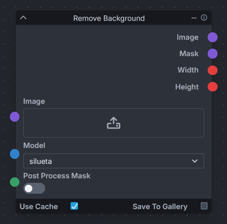

# Remove Background



The "Remove Background" node an solution for automatic background removal from images, by integrating the rembg package, which is a specialized tool based on U2NET models known for their efficiency in segmenting foreground objects with high precision.

To make use of this node, users need to perform a one-time setup by opening the developer's console in InvokeAI and installing the rembg package using the provided pip command:

```bash
pip install rembg
```

This node includes access to several pre-trained models of the U2NET architecture to cater to different segmentation needs:

- u2net: The standard U2NET model designed for general purposes, balancing accuracy and resource consumption.
- u2netp (u2net "portable"): A smaller, more efficient version of the standard model, offering faster performance with slightly less accuracy, suitable for less demanding applications.
- u2net_human_seg: A model fine-tuned for human segmentation, which work well for tasks that involve isolating people from images.
- u2net_cloth_seg: Specialized for segmenting clothing in images, splitting the subjects into upper body, lower body, and full body categories, ideal for fashion and retail applications.
- silueta: Essentially a more compact version of the U2NET model, delivering a balance between size and performance.
- isnet-general-use: A new addition aimed for general use, optimized for a broad range of segmentation tasks.
- isnet-anime: Specifically tailored for anime character segmentation, offering high precision for this particular style of imagery.
- birefnet-general: A pre-trained model for general use cases.
- birefnet-general-lite: A light pre-trained model for general use cases.
- birefnet-portrait: A pre-trained model for human portraits.
- birefnet-dis: A pre-trained model for dichotomous image segmentation (DIS).
- birefnet-hrsod: A pre-trained model for high-resolution salient object detection (HRSOD).
- birefnet-cod: A pre-trained model for concealed object detection (COD).
- birefnet-massive: A pre-trained model with massive dataset.